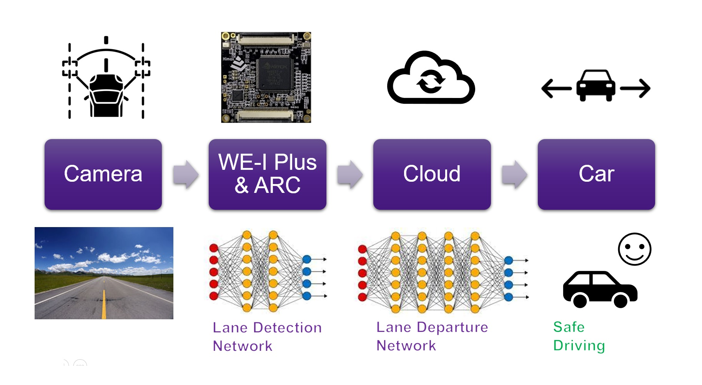

# NCKU Running Angelfish

## Lane Departure Detection System

## Introduction
Our work is lane departure detection system, combined with the popular AIoT applications in recent years. AI has been researched all over the world due to the enhancement of hardware in the past ten years, especially the Convolutional Neural Network. It is suitable for visual applications such as object detection and scene recognition. IoT has also developed rapidly in recent years, and related concepts such as the Internet of Vehicles are also becoming more popular. In the era of 5G, it is not difficult to connect the cloud computer to do lane departure detection. However, we emphasize the importance of edge computing and low power consumption. WE-I Plus's optimized computing architecture and ultra-low power consumption features can be used as an Always on Sensor at the front end, and wake up the system at the back end when a lane is detected to get ready for the departure detection. Because WE-I Plus can save power and reduce the load on the servers significantly, we believe that it will be a good device of lane departure detection system.

## System architecture
